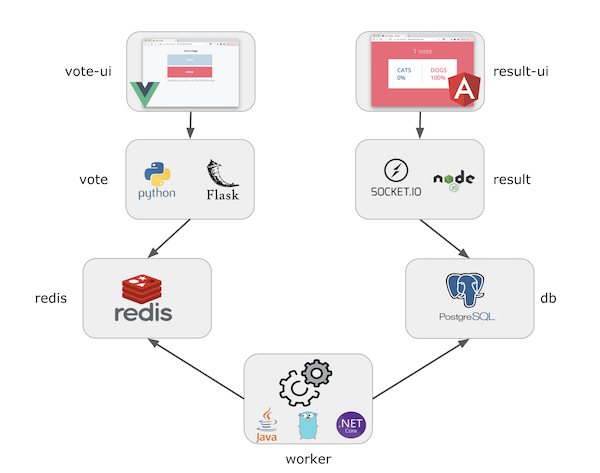

# Voting APP

Dans cet exercice, nous allons illustrer l’utilisation de *Docker Compose* pour lancer l’application *Voting App*. 

Cette application est un bon exemple d'application micro-services simple.

## Architecture

L’application *Voting App* est composée de plusieurs micro-services, ceux utilisés pour la version 2 sont les suivants:



* vote-ui: front-end permettant à un utilisateur de voter entre 2 options
* vote: back-end réceptionnant les votes
* result-ui: front-end permettant de visualiser les résultats
* result: back-end mettant à disposition les résultats
* redis: database redis dans laquelle sont stockés les votes
* worker: service qui récupère les votes depuis redis et consolide les résultats dans une database postgres
* db: database postgres dans laquelle sont stockés les résultats

## Développement des Dockerfiles pour les différents microservices
Dans cette partie, et pour chaque répertoire contient le code source de chaque microservice de l'application, la premiere etape consiste a develooper les dockerfile pour chaque microservice.

### Vote

Créer un fichier Dockerfile qui permet de construire une image Docker pour une application Flask, avec des étapes distinctes pour les environnements de développement et de production.
1. **Stage de base (`base`)** :
    - Utiliser l'image Python version 3.9-alpine3.18 comme base.
    - Définit le répertoire de travail (`WORKDIR`) à `/app`.
    - Copier le fichier `requirements.txt` contenant les dépendances Python dans le répertoire de travail de l'image `/app` (COPY requirements.txt /app/requirements.txt).
    - Installer les dépendances spécifiées dans `requirements.txt` à l'aide de `RUN pip install -r requirements.txt`.
    - Copier le reste du code source dans le répertoire de travail de l'image. ( `COPY ..` )
    - Exposer le port `5000` pour permettre l'accès à l'application Flask.

2. **Stage de développement (`dev`)** :
    - À partir du stage `base`, crée une nouvelle image pour l'environnement de développement.
    - Configurer les variables d'environnement `ENV FLASK_DEBUG=1` pour activer le mode debug de Flask et `ENV FLASK_ENV=development` pour spécifier l'environnement de développement.
    - Définir la commande par défaut pour démarrer l'application Flask en mode développement avec `CMD ["flask", "run", "--host=0.0.0.0"]`.


3. **Stage de production (`production`)** :
    - À partir du stage `base`, créer une nouvelle image pour l'environnement de production.
    - Utiliser Gunicorn comme serveur pour lancer l'application Flask.
    - Configurer Gunicorn pour écouter sur le port 5000 (`-b 0.0.0.0:5000`), enregistre les logs dans la sortie standard (`--log-file -` et `--access-logfile -`), utilise 2 workers (`--workers 2`), désactive le keep-alive (`--keep-alive 0`), et définit un timeout de 600 secondes (`--timeout 600`).

**Hints**

Utiliser cette instruction pour configurer le serveur Gunicorn :
```
CMD ["gunicorn", "app:app", "-b", "0.0.0.0:5000", "--log-file", "-", "--access-logfile", "-", "--workers", "2", "--keep-alive", "0", "--timeout", "600"]
```

**gunicorn** : C'est le serveur HTTP WSGI (Web Server Gateway Interface) pour Python qui est utilisé pour servir des applications Python web. Il est souvent utilisé comme serveur pour les applications Flask et Django, entre autres.

**app:app** : Cela indique à Gunicorn quel module et quelle application exécuter. Dans ce cas, app est le nom du module Python (généralement le nom du fichier Python principal sans l'extension .py), et la seconde app est l'instance de l'application Flask (ou autre application WSGI) à exécuter.

**-b "0.0.0.0:5000"** : Spécifie à Gunicorn sur quel hôte et port écouter les connexions entrantes. 0.0.0.0 signifie qu'il écoutera sur toutes les interfaces réseau disponibles, et 5000 est le port où l'application sera accessible.

**--log-file "-"** : Définit le fichier de journalisation des erreurs. Ici, "-" signifie que les journaux d'erreurs seront redirigés vers la sortie standard (stdout) du conteneur, ce qui est souvent pratique pour les environnements conteneurisés où les journaux sont collectés par des systèmes de journalisation externes.

**--access-logfile "-" **: Définit le fichier de journalisation des accès. Comme pour les journaux d'erreurs, "-" indique que les journaux d'accès seront redirigés vers la sortie standard du conteneur.

**--workers 2** : Spécifie le nombre de processus de travail (workers) Gunicorn à démarrer pour gérer les requêtes entrantes. Avoir plusieurs workers permet de gérer efficacement plusieurs connexions simultanées.

**--keep-alive 0 **: Désactive le mécanisme Keep-Alive HTTP, ce qui signifie que chaque connexion HTTP sera fermée après une seule requête et réponse. Cela peut être utilisé pour contrôler plus précisément la gestion des connexions et éviter les problèmes liés aux connexions persistantes dans certains scénarios.

**--timeout 600** : Définit le délai d'attente pour chaque requête en secondes. Ici, il est configuré à 600 secondes (10 minutes), ce qui permet aux connexions d'avoir un temps de réponse plus long avant d'être considérées comme expirées.

### VoteUI
Créer un Dockerfile pour construire une image NGINX qui copie les fichiers d'une application web dans le répertoire `/usr/share/nginx/html` et configure NGINX à l'aide d'un fichier `nginx.conf`.

1. **Utilisation de l'image de base (`nginx:1.22-alpine`)** :
    - Utiliser l'image NGINX version 1.22 basée sur Alpine comme base pour cette image Docker.

2. **Copier des fichiers de l'application et de configuration NGINX** :
    - Copier tous les fichiers de l'application web du répertoire local (où se trouve le Dockerfile) dans le répertoire `COPY . /usr/share/nginx/html` de l'image NGINX.
    - Copier le fichier `nginx.conf` du répertoire local dans `/etc/nginx/nginx.conf` de l'image NGINX pour configurer NGINX selon les besoins de l'application.

### Result

Créer un fichier Dockerfile qui permet de construire une image Docker pour une application Node.js. L'image Docker se compose de plusieurs étapes (stages) pour différents environnements : développement et production.

1. **Stage de base (`base`)** :
    - Utiliser l'image Node.js version 18.12.1-slim comme base.
    - Définir le répertoire de travail (`WORKDIR`) à `/app`.
    - Copier le contenu de votre répertoire de travail local dans l'image Docker.
    - Exposer le port 5000 pour permettre l'accès à l'application.

2. **Stage de développement (`dev`)** :
    - À partir du stage `base`, crée une nouvelle image pour l'environnement de développement.
    - Configurer la variable d'environnement `NODE_ENV` à `development`.
    - Exécuter `npm ci` pour installer les dépendances déclarées dans `package.json`.
    - Déplacer le répertoire `node_modules` à la racine du système de fichiers pour optimiser la performance des montages de volumes.
    - Définir la commande par défaut pour démarrer l'application en mode développement avec `npm run dev`.

3. **Stage de production (`production`)** :
    - À partir du stage `base`, crée une nouvelle image pour l'environnement de production.
    - Configurer la variable d'environnement `NODE_ENV` à `production`.
    - Configurer le cache npm à `/tmp` pour accélérer les installations de dépendances.
    - Exécuter `npm ci --omit=dev` pour installer uniquement les dépendances nécessaires pour l'exécution en production, en ignorant celles nécessaires uniquement pour le développement.
    - Changer l'utilisateur par défaut à `node` (utilisateur non-root) pour des raisons de sécurité.
    - Définir la commande par défaut pour démarrer l'application en mode production avec `npm start`.

### ResultUI

1. **Stage de sources (`sources`)** :
    - Utiliser l'image Node.js version 18.12.1-slim comme base.
    - Définir le répertoire de travail (`WORKDIR`) à `/app`.
    - Copier le contenu de votre répertoire de travail local dans l'image Docker.

2. **Stage de développement (`dev`)** :
    - À partir du stage `sources`, crée une nouvelle image pour l'environnement de développement.
    - Configurer la variable d'environnement `NODE_ENV` à `development`.
    - Configurer la variable d'environnement `NG_CLI_ANALYTICS=ci` pour désactiver les analyses de l'Angular CLI.
    - Exécuter `RUN npm ci` pour installer les dépendances déclarées dans `package.json`.
    - Définir la commande par défaut pour démarrer l'application en mode développement avec `CMD npm run dev`.

3. **Stage de build (`build`)** :
    - À partir du stage `sources`, crée une nouvelle image pour le processus de build de l'application.
    - Configurer la variable d'environnement `NG_CLI_ANALYTICS=ci` pour désactiver les analyses de l'Angular CLI.
    - Exécuter `RUN npm ci` pour installer les dépendances nécessaires.
    - Exécuter `RUN npm run build` pour construire l'application Angular.

4. **Stage de production (`production`)** :
    - Utiliser l'image Nginx version 1.22-alpine comme base pour l'environnement de production.
    - Copier le fichier de configuration `nginx.conf` dans `/etc/nginx/nginx.conf` pour configurer Nginx. (COPY nginx.conf /etc/nginx/nginx.conf)
    - Copier les fichiers générés par le build depuis le stage `build` dans `/usr/share/nginx/html/` où Nginx servira l'application. ( COPY --from=build /app/dist/result-ui/ /usr/share/nginx/html/)
    - Exposer le port 80 pour permettre l'accès à l'application via HTTP.

### Worker
Créez un Dockerfile sous `/worker/src` pour construire une image contenant une application Go dans une image minimale basée sur `scratch`.

1. **Image de build (`golang:1.16-alpine`)** :
    - Utilise l'image Alpine de Golang version 1.16 comme base pour construire l'application Go. (`FROM golang:1.16-alpine as build`)

2. **Construction de l'application** :
    - Définir le répertoire de travail dans l'image de build comme `/go/src/github.com/votingapp/worker`.
    - Copier tous les fichiers du contexte de construction dans ce répertoire.
    - Utiliser `go build` pour compiler l'application Go en un exécutable nommé `worker`. (`RUN CGO_ENABLED=0 GOOS=linux go build -a -installsuffix cgo -o worker .`)
   **Nb:** . : Fait référence au répertoire actuel où se trouve le code source Go à compiler.

3. **Image finale (`scratch`)** :
    - Utiliser une image vide (`scratch`) comme base, ce qui crée une image Docker minimale sans système d'exploitation ni bibliothèques.
    - Copier l'exécutable `worker` compilé à partir de l'étape précédente dans le répertoire racine de l'image scratch. (`COPY --from=build /go/src/github.com/votingapp/worker/ .`)

4. **Commande par défaut (`CMD ["./worker"]`)** :
    - Définir la commande par défaut à exécuter lorsque le conteneur basé sur cette image est démarré, ici `./worker`, l'exécutable de l'application Go.

## Configuration Docker Compose pour une application de vote


Configurer un environnement Docker Compose de dev pour l'application de vote utilisant les services developpés.

#### Services inclus :

1. **Configurer Traefik comme Reverse Proxy :**
   - Utiliser l'image `traefik:v2.9.6`.
   - Exposer les ports 80 et 8080 pour le trafic HTTP et l'API Traefik respectivement. ( ports:"80:80" et "8080:8080")
   - Monter le socket Docker pour permettre à Traefik de découvrir les nouveaux services Docker.
   - Connecter ce service au réseau nommé `front-tier`.

**Hints**
- Pour appliquer l'exercice avec Traefik, vous devez ajouter les domaines `vote.traefik.me` et `result.traefik.me` à votre fichier hosts, qui se trouve à `/etc/hosts` sur Linux et `C:\Windows\System32\drivers\etc\hosts` sur Windows.

```
 127.0.0.1 vote.traefik.me
 127.0.0.1 result.traefik.me
```

- Monter le socket Docker via l'instruction:
```
  volumes:
  - "/var/run/docker.sock:/var/run/docker.sock:ro"
```

- Ajouter cette instruction dans le docker compose, elle est très importante pour configurer Traefik, 
```
command:
# - "--log.level=DEBUG"
- "--api.insecure=true"
- "--providers.docker=true"
- "--providers.docker.exposedbydefault=false"
- "--entrypoints.web.address=:80"
```
##### Explication: 

**--api.insecure=true** :

Cela active l'API Traefik en mode insecure, ce qui signifie que l'API peut être accessible sans authentification. Dans un environnement de développement ou pour des tests locaux, cela peut être utile pour faciliter l'accès et le débogage. En production, il est recommandé de désactiver cette option et de sécuriser l'API avec des mécanismes d'authentification appropriés.

**--providers.docker=true** :

Cette option indique à Traefik d'écouter et de découvrir automatiquement les services Docker disponibles. Traefik peut ainsi surveiller les conteneurs Docker en cours d'exécution et configurer dynamiquement les routes et les règles nécessaires pour diriger le trafic vers ces services.

**--providers.docker.exposedbydefault=false** :

Par défaut, Traefik expose tous les services Docker découverts. En définissant cette option sur false, on indique à Traefik de ne pas exposer automatiquement tous les services qu'il détecte. Cela permet un contrôle plus fin sur quels services doivent être exposés et accessibles via Traefik.

**--entrypoints.web.address=:80** :

Cela spécifie que Traefik doit écouter sur le port 80 pour le trafic HTTP entrant. Le : avant le port 80 signifie que Traefik écoutera toutes les interfaces réseau disponibles (0.0.0.0) sur ce port.

2. **Services de l'application :**
   - **Service Vote :**
      - Construire à partir du contexte `../vote` avec un `Dockerfile` ciblant la configuration de développement (`dev`).
      - Dépendre du service Redis avec une condition de santé pour assurer la disponibilité.
      - Monter le répertoire ../vote sur votre machine hôte dans le chemin /app à l'intérieur du conteneur Docker.
      - Connecter ce service au réseau nommé `front-tier` et `back-tier`.

**Hints**

- Pour cibler la configuration de dev, utiliser ces instructions :
```
target: dev
```
- Utiliser cette instruction pour faire la dépendance avec une condition de santé:
```
depends_on:
   redis:
      condition: service_healthy
```

   - **Vote-UI :**
Le service vote-ui est configuré pour construire son image à partir du répertoire ../vote-ui. Il dépend du démarrage du service vote, avec la condition que celui-ci soit démarré avant que vote-ui puisse fonctionner correctement. Il doit être configuré avec Traefik pour diriger le trafic vers vote.traefik.me. 
Il monte également le contenu généré dans ../vote-ui dans Nginx pour servir les fichiers statiques, expose le port 5000 localement, et est connecté au réseau front-tier pour la communication avec d'autres services. Le redémarrage du conteneur est géré automatiquement, à moins que l'arrêt explicite ne soit requis.

**Hints**
- Pour étiquetter Traefik, on ajoute cette Instruction:
```
    labels:
      - "traefik.enable=true"
      - "traefik.http.routers.voteui.rule=Host(`vote.traefik.me`)"
      - "traefik.http.routers.voteui.entrypoints=web"
      - "traefik.http.services.voteui.loadbalancer.server.port=80"
```
- Définir que ce service dépend du service vote. La condition spécifiée (service_started) assure que vote-ui démarrera après que vote ait été démarré.
```
    depends_on:
      vote:
        condition: service_started
```
- L'instruction suivante indique que ce service doit être redémarré automatiquement sauf s'il est explicitement arrêté.
```
    restart: unless-stopped
```
Le dossier local ../vote-ui est monté dans /usr/share/nginx/html à l'intérieur du conteneur Docker
```
    volumes:
      - ../vote-ui:/usr/share/nginx/html
```

   - **Service Result :**
Le service result est configuré pour construire une image à partir du Dockerfile situé dans ../result, dépendre du service db en s'assurant que ce dernier est "en bonne santé" avant de démarrer. Il monte également le contenu local dans /app du conteneur Docker, est connecté aux réseaux front-tier et back-tier pour la communication avec d'autres services, et est configuré pour être utilisé dans un environnement de développement grâce à la spécification target: dev dans le Dockerfile.

   - **Result-UI :**
Le service result-ui dans ce contexte de Docker Compose est configuré pour construire une image à partir du Dockerfile situé dans ../result-ui, dépendant du service result en s'assurant que celui-ci est démarré avant de démarrer lui-même. Il expose son interface utilisateur sur le port `5001` de l'hôte, utilise Traefik pour le routage via `result.traefik.me` sur le port `80`, monte les fichiers source depuis `../result-ui/src` dans `/app/src` du conteneur, et est connecté au réseau `front-tier` pour la communication avec d'autres services.
Configurer le redémarrage automatique du conteneur result-ui sauf indication contraire, assurant ainsi que le service reste disponible même en cas d'arrêt inattendu.

**Hints**
Le service `result-ui` est étiquetté avec ces instructions pour la configuration Traefik :
```
labels:
- "traefik.enable=true"
- "traefik.http.routers.resultui.rule=Host(`result.traefik.me`)"
- "traefik.http.routers.resultui.entrypoints=web"
- "traefik.http.services.resultui.loadbalancer.server.port=80"
```
   - **Worker :**
Le service worker est configuré pour construire une image à partir du Dockerfile situé dans ../worker/src. Il dépend des services redis et db, ne démarrant que lorsque ces derniers sont marqués comme "healthy". Le service est connecté au réseau back-tier, facilitant ainsi la communication avec d'autres services connectés à ce réseau.

**Hints**
- Utiliser l'instruction suivante pour assuer la dépendance avec condition:
```
depends_on:
   redis:
      condition: service_healthy
   db:
      condition: service_healthy
```

   - **Services de Stockage de Données :**
      - **Redis :**

Le service redis utilise l'image Redis 7.0.5 basée sur Alpine Linux 3.16. Il est configuré avec un test de santé qui vérifie régulièrement la disponibilité de Redis en exécutant redis-cli ping en spécifiant l'intervalle entre chaque test de santé toutes les 5 secondes.
Le service est exposé sur le port 6379 et connecté au réseau back-tier pour permettre la communication avec d'autres services utilisant le même réseau.    

**Hints**:

Configurer le test de santé et la vérification régulière de la disponibilité de Redis avec cette instruction :

```
    healthcheck:
      test: ["CMD", "redis-cli", "ping"]
      interval: "5s"
```
- **PostgreSQL :** 

Le service db utilise l'image PostgreSQL 15.0 basée sur Alpine Linux 3.16. Il est configuré avec un utilisateur PostgreSQL postgres, un mot de passe postgres, monte le volume nommé db-data sur le chemin /var/lib/postgresql/data à l'intérieur du conteneur PostgreSQL, et est accessible sur le port 5432. Un test de santé vérifie régulièrement la disponibilité de PostgreSQL en vérifiant si pg_isready peut se connecter en utilisant l'utilisateur postgres. Le service est connecté au réseau back-tier pour permettre la communication avec d'autres services utilisant le même réseau.
Utiliser un fichier d'environnement **.env** (dans le même endroit que le fichier compose) pour déclarer les paramètres de connexion à la base de données.

**Hints**

- La déclaration des paramètres de connexion à la base de données se fait moyennant l'instruction suivante :
```
    environment:
      POSTGRES_USER: ${POSTGRES_USER}
      POSTGRES_PASSWORD: ${POSTGRES_PASSWORD}
```
- Configurer le test de santé et la vérification régulière de la disponibilité de Postgres avec cette instruction :
```
   healthcheck:
      test: ["CMD", "pg_isready", "-U", "${POSTGRES_USER}"]
      interval: "5s"
```

3. **Volumes et Réseaux :**
   - Utiliser un volume nommé `db-data` pour persister les données de PostgreSQL.
   - Définir deux réseaux : `front-tier` pour les services accessibles depuis l'extérieur (UIs) et `back-tier` pour les services internes (Redis, PostgreSQL, NATS).

#### Instructions :
- Créer un fichier `docker-compose.yml` avec la configuration décrite.
- Utiliser Docker Compose pour construire et démarrer l'environnement avec `docker compose up -d`.
- Vérifier que tous les services démarrent correctement avec `docker compose ps`.
- Tester l'accès aux interfaces utilisateurs via les adresses configurées (`vote.traefik.me` et `result.traefik.me`) et le fonctionnement du dashboard Traefik.
- Pensez à pousser les images Docker dans votre dépôt Docker Hub, puis modifiez le fichier docker-compose pour qu'il utilise directement ces images, sans passer par l'étape de construction des Dockerfiles.
## Scaling du service

Par défaut, un container est lancé pour chaque service. Il est possible de changer ce comportement et de scaler un service une fois qu’il est lancé.

Augmenter le nombre de worker à 2.

**Hints**
```
docker compose -f compose.dev.yaml up -d --scale <nom-du-service> = nb
```

Vérifiez qu'il y a à présent 2 containers pour le service worker:

```
docker compose -f compose.dev.yaml ps
```
Essayer de scaler les services *vote-ui* et *result-ui*.

## Suppression de l’application

Avec la commande suivante, stoppez l’application. Cette commande supprime l’ensemble des éléments créés précédemment à l'exception des volumes (afin de ne pas perdre de données)

```
docker compose down
```

Afin de supprimer également les volumes utilisés, il faut ajouter le flag *-v*:

```
docker compose down -v
```
